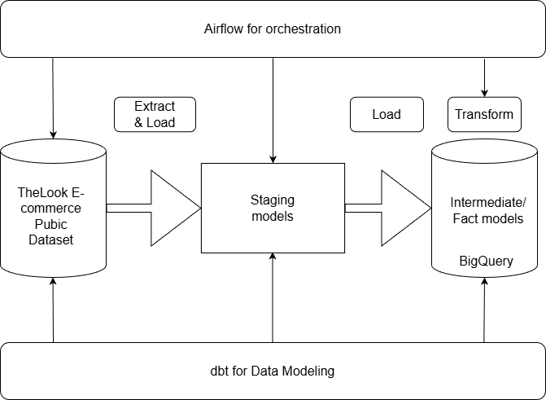

# 1. Project Overview
- An Airflow project serves as the continuation of the dbt project titled: looker-ecommerce-bigquery-elt-pipeline designed to explore modern ETL/ELT pipeline orchestration, data warehousing and infrastructure management. This project covers the use of Docker for containerization, distro like Ubuntu for cloud computing and DAGs run through python scripts. 

Below shows the high-level flowchart depicting the architecture of the project.

# 2. Tech Stack and Environment

- Programming Languages: Python v3.11
- Pipeline Orchestration: Apache Airflow v2.9.3
- Environment Setup: Docker Compose
- Operator: BashOperator
- IDE: Pycharm 2025.3.1
- Version Control: Git/GitHub
- OS: Windows 11

# 3. Airflow DAGs and Pipeline Structure

## Key Folder structure:

- dags: Contains Airflow DAGs. This project uses dbt_dag.py to trigger dbt runs.
- plugins: Reserved for custom operators, sensors, or hooks (empty in this project).
- dbt_project: placeholder for dbt_project folder (empty).

## DAG Overview
- DAG ID: dbt_run_dag
- Purpose: Automates dbt models execution in this project
- Schedule: Runs daily (@daily) starting Jan 1, 2025.
- Catchup: Disabled (catchup=False) to prevent historical runs.
- Task:
  - dbt_run – Executes a Bash command to navigate to the dbt project folder and run dbt run with the appropriate profiles directory.

## Operators and Hooks
- BashOperator: Runs shell commands inside the Airflow Container.
- No additional hooks or custom operators used.

## Task Dependencies
Single-task DAG: No explicit upstream/downstream dependencies as dbt_run is the only task.

## Error Handling
- Uses Airflow defaults: retries and SLA are not explicitly configured.
- Airflow container logs and DAG monitoring provide task-level visibility.

## Execution Environment
- Docker Compose Services:
  - postgres: Metadata database for Airflow.
  - airflow-webserver: Web UI for DAG management and monitoring.
  - airflow-scheduler: Triggers DAG runs according to schedule.
- Dockerfile: Installs dbt-core and dbt-bigquery inside the Airflow container to enable DAG execution.

Notes:
- The DAG triggers dbt models in the mounted dbt project folder, ensuring modular separation between Airflow orchestration and dbt transformations.
- All configurations are containerized, making the pipeline reproducible and portable.

## 4. Output and Results

### Big Query Output

Screenshot depicting materialized views and tables under dbt_dataset schema in BigQuery. The models are created from scheduled Airflow runs.

fct_orders table showing final row count.

int_order_items table showing final row count.

### Airflow and dbt output

dbt_run and dbt_test executes successfully

dbt_run and dbt_test graph shows successful execution

dbt_run log shows successful run

dbt_test log shows successful run

# 5. Running the Project

## Prerequisites

- Ubuntu (tested on 24.04)
- Docker and Docker Compose
- Python 3.10 (local environment)
- Git
- Apache Airflow 2.9.3

## 1. Clone Github Repository

git clone https://github.com/lowejie/looker-ecommerce-dbt-airflow-orchestration.git
cd looker-ecommerce-bigquery-dbt-airflow-orchestration

## 2. Setup Environment

1. Create virtual python environment within distro like Ubuntu. \
python3 -m venv venv \
source venv/bin/activate
2. Copy project folders including dbt project folder into Ubuntu environment.
3. Update configurations in docker-compose.yml and dags/dbt_dag.py file to match filepaths.
4. Start Airflow services with: \
docker-compose up -d
5. Manually trigger DAG via UI at localhost:8080 \
Based on configurations, DAG will also run automatically according to pre-defined schedule.

Note: \
- Using Ubuntu ensures compatibility and avoids version conflicts between Airflow, dbt, and system dependencies.

# 6. Challenges and Learnings

## Challenges
- Resolving conflicting file paths between Windows and Ubuntu, which required careful path adjustments for DAGs and dbt project references.
- Configuring DAGs, operators, and task dependencies correctly to ensure proper execution and scheduling.
- Setting up Airflow in a local environment initially caused package conflicts, leading to a switch to Ubuntu for a stable and isolated environment.

## Learnings
- Gained practical experience in Airflow environment setup, DAG design, task orchestration, and monitoring.
- Understood integration with dbt and BigQuery, reinforcing the importance of end-to-end workflow management and the role of orchestrators in production-grade data engineering pipelines.
- Learned to implement reliable workflow patterns, including task retries, scheduling strategies, and observability best practices.

# 7. Future Improvements

- Introduction of dynamic DAGs
- Better logging/monitoring approaches such as Airflow alerting
- Incremental task execution
- Streaming ingestion
- CI/CD pipelines integration

# 8. References

This project is a continuation from a dbt_project at another repository at: \
https://github.com/lowejie/looker-ecommerce-bigquery-elt-pipeline

Inspired by a YouTube ELT pipeline tutorial using dbt, Snowflake, and Airflow. The Airflow implementation deviates from the original design. Apache Airflow is initialized and run via Docker on Ubuntu.

Youtube tutorial video for the dbt project \
Code along - build an ELT Pipeline in 1 Hour (dbt, Snowflake, Airflow) by jayzern \
Link: https://www.youtube.com/watch?v=OLXkGB7krGo

Docker documentation \
Docker Get Started \
Link: https://docs.docker.com/get-started/

Airflow documentation \
Apache Airflow \
Link: https://airflow.apache.org/docs/apache-airflow/stable/index.html